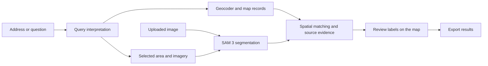

# Sat-Seg

**Find places, segment satellite imagery, and turn detections into useful map labels.**

Sat-Seg is a local map application that brings together address search, aerial imagery,
SAM 3 segmentation, and geographic data. Search for a location, draw an area, ask for
buildings or trees, and inspect their outlines on a map. Attach available names and
addresses, review the labels, compare images from different dates, and export the results.

The browser interface is called **Geo Explorer**. Model inference runs on your computer;
map records and aerial imagery come from configurable providers.

[Setup](#setup) · [How to use](#how-to-use) · [Example inputs](#example-inputs) ·
[Training](#training) · [Documentation](#documentation)

## Problems it helps solve

| Problem | How Sat-Seg helps |
| --- | --- |
| An image shows buildings but does not identify their names or addresses. | Match detected footprints to geographic records and inspect the source evidence. |
| Finding schools, hospitals, parks, or other places means switching between tools. | Search by address, question, category, coordinates, geohash, or selected map area. |
| Outlining objects manually takes time. | Use SAM 3 to propose outlines, then review, relabel, or reject detections. |
| Two images are difficult to compare because they are shifted or differently framed. | Preview automatic or manual alignment, then highlight added and removed detection regions. |
| Analysis results are hard to reuse outside a notebook. | Use a browser, Python package, CLI, or HTTP API and export map and image labels. |

It is designed for satellite-image exploration, geographic research, annotation, and
building a local computer-vision workflow. Results are reviewable candidates; the app
does not guarantee complete map coverage or verified building identities.

## Features

- **Search and locate:** address/place candidates, common natural-language requests,
  latitude/longitude, geohashes, map categories, and custom OpenStreetMap tags.
- **Segment a selected area:** draw, move, or resize a map box; retrieve supported
  aerial imagery; detect concepts such as `building`, `tree`, `water`, and `road`.
  Overlapping inference windows cover the selection and merge duplicate candidates.
- **Connect detections to map data:** inspect names, addresses, tags, source identifiers,
  fetch times, and spatial matches. Filter results with or without address evidence.
- **Review and export:** edit labels, reject detections, and export GeoJSON, CSV,
  annotated images, and labels in image coordinates.
- **Compare before and after:** accept PNG, JPEG, or GeoTIFF pairs; preview automatic
  or manual alignment; inspect a swipe view and candidate changes.
- **Bring your own data:** upload images or import an existing GeoJSON map layer.
- **Train a tile classifier:** validate a labeled dataset, train ResNet-18, evaluate it,
  save the best checkpoint, and classify new RGB tiles.
- **Configure local models:** reuse SAM 3 weights and optionally an installed Ollama
  model for broader language requests. Settings persist locally.
- **Track longer jobs:** view progress and cancel analysis; the server schedules its
  model workloads so they share the GPU.

## How it works



SAM finds **visible shapes and concepts**. Geographic records supply **names, addresses,
and mapped uses**. An optional Ollama model interprets the request; it is not the source
of geographic facts. Common queries work without an LLM, and SAM already includes its
own text encoder for visual prompts.

For example, finding hospitals starts with mapped hospital records. A roof shape alone
cannot reliably establish that a building is a hospital. Spatial matches remain
candidates, and missing names or addresses stay unknown.

## Setup

### Requirements

- Windows with Git and Conda available in your terminal.
- Python **3.11**, installed inside the `sat_clas` Conda environment below.
- An NVIDIA GPU and a driver compatible with your selected CUDA PyTorch build.
  The development setup uses an **RTX 3090 with 24 GB VRAM and 32 GB system RAM**;
  this is a tested configuration, not a measured minimum requirement.
- Access to [SAM 3 weights](https://huggingface.co/facebook/sam3) for segmentation.
  Weights are stored outside Git.
- Internet access for provider lookups and imagery retrieval. Ollama is optional
  and installed separately.

Already have the project and environment configured? From the repository folder:

```powershell
conda run --no-capture-output -n sat_clas python -m src.cli serve
```

Open **http://127.0.0.1:8765**. Otherwise, follow the installation steps below.

### 1. Clone and install

Run in PowerShell or an Anaconda Prompt with `conda` on PATH. Cloning a private
repository requires a GitHub account with access.

```powershell
git clone https://github.com/GhoshSrinjoy/Sat-Seg.git
cd Sat-Seg

powershell -NoProfile -File .\scripts\initialize_project.ps1
conda create --name sat_clas --override-channels --channel conda-forge python=3.11 pip --yes
conda run --no-capture-output -n sat_clas python -m pip install torch torchvision --index-url https://download.pytorch.org/whl/cu130
conda run --no-capture-output -n sat_clas python -m pip install -r requirements.txt
conda run --no-capture-output -n sat_clas python -m pip install --no-deps -e .
conda run --no-capture-output -n sat_clas python -m ipykernel install --user --name sat_clas --display-name "Python (sat_clas)"
```

These commands use the project's tested CUDA 13.0 wheel channel. `cu130` selects a
CUDA build; package versions are left unpinned so pip resolves compatible stable
releases. For different hardware or drivers, select the appropriate build using the
[official PyTorch installation guide](https://pytorch.org/get-started/locally/).

Alternatively, `conda env create --file environment.yml` replaces the Conda creation
and dependency-install steps. Then run the editable-install and notebook kernel
commands. Use one method; do not recreate an existing `sat_clas` environment.

### 2. Check GPU support

```powershell
conda run --no-capture-output -n sat_clas python -m src.utils.verify_environment
conda run --no-capture-output -n sat_clas python -c "import torch; print('CUDA available:', torch.cuda.is_available()); print('GPU:', torch.cuda.get_device_name(0) if torch.cuda.is_available() else 'unavailable')"
```

For the GPU workflow, the output should report `CUDA available: True` and your GPU
name. The verifier also checks supporting package imports and basic GPU operations.

### 3. Configure SAM 3

Check `sam3.cache_dir` and `sam3.revision` in
[configs/default.yaml](configs/default.yaml). The default cache root is
`D:/data/models`; change it to your model directory on another machine. The loader
expects a Hugging Face cache layout:

```text
D:/data/models/
  models--facebook--sam3/
    snapshots/<revision>/
      config.json
      model.safetensors
      ...processor and tokenizer files
```

Inspect the cache **before downloading**:

```powershell
conda run --no-capture-output -n sat_clas python -m src.models.sam3_loader --inspect
```

If the report shows a complete cache, reuse it. If files are missing, obtain access
through the [SAM 3 model page](https://huggingface.co/facebook/sam3), sign in with
the Hugging Face CLI, and explicitly download the configured snapshot:

```powershell
conda run --no-capture-output -n sat_clas hf auth login
conda run --no-capture-output -n sat_clas python -m src.models.sam3_loader --download-missing
```

Then verify loading:

```powershell
conda run --no-capture-output -n sat_clas python -m src.models.sam3_loader --load
```

The app loads weights locally and does not automatically download them. It uses
the Transformers SAM 3 implementation, including extraction of the image detector
from the supported composite SAM 3 checkpoint.

### 4. Start the app

```powershell
conda run --no-capture-output -n sat_clas python -m src.cli serve
```

- **Workspace:** http://127.0.0.1:8765
- **Settings:** http://127.0.0.1:8765/settings
- **API documentation:** http://127.0.0.1:8765/docs

Keep the terminal open; press **Ctrl+C** there to stop the server. After
`conda activate sat_clas`, the shorter command `sat-clas serve` is equivalent.

### 5. Optional: enable Ollama

Start your separately installed Ollama service. In **Settings**, select an
installed local text-generation model and use **Test selected model**. Enable
**Use Ollama for natural language** in Explore for model-assisted interpretation.
No Ollama models are downloaded automatically.

Settings changes are stored in `configs/local.yaml`, which is ignored by Git.
The server coordinates its SAM, Ollama, and training workloads to manage GPU
memory; other applications using the GPU remain outside that coordination.

## How to use

### Find and label an area

1. In **Explore**, search `Berkeley, California` or `Alexanderplatz, Berlin`.
   Select the intended place if several candidates appear.
2. Enter `building` or `building, tree` in **What should SAM find?**
3. Click **Draw area** and select a small neighborhood. Aerial imagery switches
   on, and SAM runs if **Run SAM after drawing a box** is enabled.
4. After changing the concept or resizing the box, click **Analyse selected area**.
5. Inspect outlines and results. Use **Match addresses** to attach available map
   evidence; review labels or reject incorrect detections.
6. Download GeoJSON, CSV, an annotated image, or image labels.

Use **Search with → Map records** for geographic records, **Satellite / SAM** for
visual detections, or **SAM + map names and addresses** to combine the workflows.
Schools, hospitals, and other mapped categories are also available under
**Find mapped places and addresses**.

### Analyse your own image

Open **Advanced → Segment an uploaded image**. Upload a PNG, JPEG, or GeoTIFF,
enter a visual concept, and run segmentation. Specify RGB band indexes if a
multiband raster does not declare them.

Georeferenced images can produce map footprints. Images without coordinates
produce labels in image space. Optional bounds are only appropriate for an
already north-up, orthorectified image; a bounding box does not rectify a camera photo.

### Compare two dates

Open **Compare**, upload Before and After images of the same scene, and enter
the concept to compare. Choose automatic alignment, an already aligned grid, or
at least four corresponding landmark pairs for manual alignment. Click
**Preview alignment**, inspect the swipe view, then **Compare aligned images**.

The output highlights added and removed detection regions. These are change
candidates: seasons, shadows, resolution, registration, and model errors can also
create differences. Historical images must be supplied; entering dates alone
does not retrieve historical imagery.

## Example inputs

Enter these in Explore. “Here” and “this area” refer to the selected map area or
current view. Enrichment and filtering require existing results.

| Task | Input |
| --- | --- |
| Find an address | `1600 Amphitheatre Parkway, Mountain View, California` |
| Find mapped hospitals | `Find hospitals in this area` |
| Find mapped schools | `Where are the schools in this area?` |
| Detect visible objects | `Detect buildings and trees here` |
| Attach map information | `Label these buildings with names and addresses` |
| Filter current results | `Only show buildings without addresses` |
| Display recorded hiking routes | `Show hiking routes in this area` |
| Jump to coordinates | `52.52,13.405` |
| Display a geohash cell | `geohash: u33dc1` |

For another category, enter an OSM tag such as `amenity=pharmacy` or
`tourism=museum` in the custom-tag field. Include city and country when an address
is ambiguous. Search coordinates use **latitude, longitude**; GeoJSON and bounding
boxes use **longitude, latitude**.

## Coverage and current limits

| Data or operation | Current scope |
| --- | --- |
| Place/address and feature queries | Worldwide where source records are available; small-area interactive requests. |
| Built-in aerial imagery | Berlin orthophotos and USGS NAIP for the contiguous United States. |
| Imagery elsewhere | Upload an image or configure a compatible WMS provider in Settings. |
| Default area-analysis limits | 25 km², 4 million pixels, and 25 inference windows; settings and resolution determine which limit is reached first. |
| Hiking | Display recorded routes; turn-by-turn route calculation is not implemented. |
| Building identity | Source records and tentative spatial matches; no guarantee of an exact name/address for every detection. |
| Model quality | A working prototype with functional checks; no global accuracy benchmark or production coverage guarantee. |

Geohashes identify geographic cells, not unique buildings. A building can contain
several tenants, and a school or hospital can span several buildings.

Address/place lookups use [Photon](https://github.com/komoot/photon); feature
queries use [Overpass](https://wiki.openstreetmap.org/wiki/Overpass_API). Search
text and requested areas are sent to the configured providers. Uploaded images
and model inference are handled locally. See the
[workspace guide](docs/map_workspace.md#imagery-sources) for imagery sources,
attribution, acquisition details, WMS requirements, and cache behavior.

## Training

SAM 3 can segment prompts using its existing weights. This repository's trainer
trains a **separate ResNet-18 RGB tile classifier**; it does not fine-tune SAM or
learn building names and addresses.

Provide reviewed RGB PNG/JPEG tiles and a CSV manifest:

```csv
path,label,split,group
tiles/region_a_roof.png,building,train,region_a
tiles/region_a_forest.png,forest,train,region_a
tiles/region_b_roof.png,building,val,region_b
tiles/region_b_forest.png,forest,val,region_b
tiles/region_c_roof.png,building,test,region_c
tiles/region_c_forest.png,forest,test,region_c
```

Paths are relative to the manifest unless absolute. This illustrates the format,
not an adequate dataset. Keep areas/scenes separate across splits; the loader
checks geographic group leakage and identical files across splits.

Use **Advanced → Training**, or run after activating the environment:

```powershell
sat-clas train --manifest D:/data/my_dataset/manifest.csv --output outputs/training/first_model --epochs 20 --batch-size 16
sat-clas classify D:/data/my_dataset/new_tile.png --checkpoint outputs/training/first_model/best.pt
```

Each run saves the best checkpoint, training history, manifest, configuration,
and evaluation reports. The classifier starts from random weights; only synthetic
training smoke checks have been performed so far. Real-world training needs a
representative labeled dataset. SAM fine-tuning remains a separate, unimplemented
workflow requiring segmentation annotations.

See the [training guide](docs/training_and_map_workflows.md#train-a-classifier-with-your-data)
for preparation, evaluation, and checkpoint usage.

## CLI, notebooks, and package

After `conda activate sat_clas`, commands are available as either `sat-clas ...`
or `python -m src.cli ...`:

```powershell
sat-clas --help
sat-clas search "Alexanderplatz, Berlin"
sat-clas features --bbox 13.40 52.51 13.42 52.52 --category schools
sat-clas segment D:/data/my_scene.tif --prompt building --enrich
sat-clas compare D:/data/before.png D:/data/after.png --prompt building --alignment auto
```

The standalone `segment` command and exploration notebook retain a single-window
workflow of up to 1008×1008 pixels, with an explicit window-origin option. The
browser's area and upload workflows process the full selection/image within
configured limits.

```powershell
python -m jupyterlab notebooks
```

Open [the exploration notebook](notebooks/01_environment_and_raster_exploration.ipynb),
select **Python (sat_clas)**, and use **Restart Kernel → Run All**. It can download
a small Berkeley demo once, then load imagery, run local SAM inference, visualize
detections, and export results. Optional cells cover map matching and training.

Build an installable wheel with:

```powershell
python -m pip wheel --no-deps . --wheel-dir dist
```

The wheel bundles Python modules, the web interface, defaults, and CLI. Weights
and data remain external. See the
[package guide](docs/training_and_map_workflows.md#package-and-python-api) for
Python usage and configuration on another machine.

## Project layout

```text
Sat-Seg/
  configs/          Shared defaults; ignored local settings
  data/             Raw imagery, processed data, temporary files and caches
  docs/             Workspace, training, setup and verification guides
  notebooks/        Exploration and inference notebook
  outputs/          Predictions, reviewed labels, training runs and logs
  scripts/          Setup, environment export and verification tools
  src/
    data/           Raster loading and preprocessing
    geo/            Geocoding, map records, imagery and spatial matching
    inference/      SAM inference, tiling, GPU scheduling and comparison
    interface/      FastAPI server, background jobs and browser interface
    language/       Query parsing and optional Ollama integration
    models/         SAM loader and classifier architecture
    training/       Training, evaluation and checkpoint inference
    utils/          Configuration and environment checks
    cli.py          sat-clas entry point
  tests/            Geographic, image, settings and API tests
  environment.yml   Conda specification with unpinned package versions
  requirements.txt  Python dependencies
  pyproject.toml    Package definition
```

Local settings, datasets, generated outputs, build artifacts, and weights are
excluded from Git. Shared settings live in `configs/default.yaml`; UI overrides
live in `configs/local.yaml`. `SAT_CLAS_HOME`, `SAT_CLAS_CONFIG`, and
`SAT_CLAS_SETTINGS` can override their locations.

## Verification and reproducibility

```powershell
conda run --no-capture-output -n sat_clas python -m unittest discover -s tests -v
```

The current suite includes 16 tests covering geographic matching, query parsing,
data leakage, alignment, tiling, provider limits, settings, and HTTP jobs. These
functional checks do not measure real-world segmentation accuracy.

The input specifications leave dependency versions unpinned. Record the versions
resolved on your machine with:

```powershell
conda run --no-capture-output -n sat_clas python scripts/export_environment.py
```

This writes [docs/environment.resolved.yml](docs/environment.resolved.yml) and
[docs/installed_packages.json](docs/installed_packages.json). To restore the
recorded environment on a compatible Windows machine, create it from the resolved
YAML, then install the checkout with `python -m pip install --no-deps -e .`.

## Documentation

- [Map workspace, imagery providers, model settings, and comparison](docs/map_workspace.md)
- [Input types, source matching, training, CLI, and Python API](docs/training_and_map_workflows.md)
- [Initial environment setup report](docs/setup_report.md)
- [Initial application verification record](docs/application_verification.md)
- [Transformers SAM 3 documentation](https://huggingface.co/docs/transformers/model_doc/sam3)

## License

Project code is licensed under the [MIT License](LICENSE). SAM weights and
external map/imagery data have their own terms and attribution requirements.
